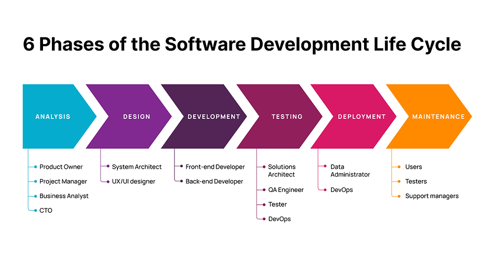

# Software Development and Documentation Approaches :
1. The waterfall model: **Plan-driven**  model. Separate and distinct phases of specification and development.

2. Agile development: **Specification**, **development** and **validation** are interleaved. May be plan-driven or agile.

## Waterfall model phases:
- Requirements analysis and definition
- System and software design
- Implementation and unit testing
- Integration and system testing
- _Deployment_, Operation and maintenance

### The main drawback of the waterfall model is the difficulty of accommodating change after the process is underway. 

#### to know more about SDLC
[visit](https://aws.amazon.com/what-is/sdlc/)

